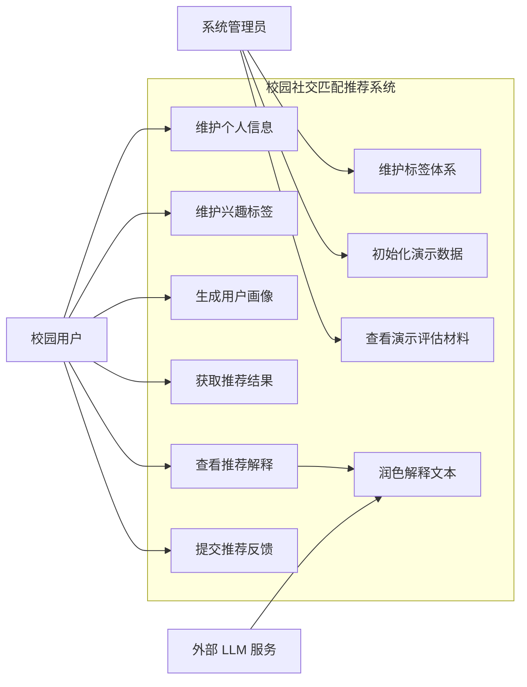
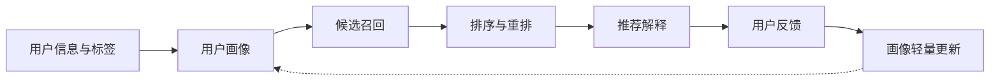

# Chapter 3 Diagram Drafts

本页提供第 3 章需求分析图表的可绘制底稿。图号、表号和题注仅为建议，最终编号以学校 Word 模板为准。

## 1. 图 3-1 系统用例图

### 1.1 论文题注建议

图 3-1 系统用例图

### 1.2 参与者与用例

| 参与者 | 主要用例 |
| --- | --- |
| 校园用户 | 维护个人信息、维护兴趣标签、生成用户画像、获取推荐结果、查看推荐解释、提交反馈 |
| 系统管理员 | 维护标签体系、初始化演示数据、查看演示评估材料 |
| 外部 LLM 服务 | 对规则解释文本进行润色；不可参与召回、排序、重排、可信连接分和反馈更新 |

### 1.3 Mermaid 底稿



### 1.4 正文衔接写法

可放在第 3.3 节功能需求展开前：

> 系统用例如图 3-1 所示。校园用户是系统的主要使用者，围绕个人信息、兴趣标签、用户画像、推荐结果、推荐解释和推荐反馈展开操作；系统管理员负责标签体系维护、演示数据初始化和评估材料查看。外部 LLM 服务仅作为解释文本润色能力存在，不参与推荐计算链路。

## 2. 图 3-2 需求闭环流程图

### 2.1 论文题注建议

图 3-2 需求闭环流程图

### 2.2 流程说明

```text
用户信息与标签
-> 用户画像
-> 候选召回
-> 排序与重排
-> 推荐解释
-> 用户反馈
-> 画像轻量更新
```

### 2.3 Mermaid 底稿



### 2.4 正文衔接写法

可放在第 3.5 节数据需求前后：

> 需求闭环如图 3-2 所示。用户信息和标签是画像生成的基础，画像驱动候选召回和排序重排，推荐解释用于说明结果依据，用户反馈再回到画像轻量更新环节。该闭环决定了系统后续概要设计、详细实现和测试验证的主线。

## 3. 表 3-1 系统功能需求表

### 3.1 论文表题建议

表 3-1 系统功能需求表

### 3.2 表格底稿

| 编号 | 需求名称 | 需求说明 | 对应实现 |
| --- | --- | --- | --- |
| FR-01 | 用户管理 | 支持用户基础信息创建、查询和维护 | `UserController`, `UserService` |
| FR-02 | 标签管理 | 支持标签定义、分类和用户标签绑定 | `TagController`, `TagService` |
| FR-03 | 用户画像生成 | 根据用户标签关系生成可计算画像 | `ProfileService`, `ProfileServiceImpl` |
| FR-04 | 改进 TF-IDF 权重计算 | 综合标签频次、时间衰减和 Top-K 裁剪 | `ImprovedTfIdfProfileWeightCalculator` |
| FR-05 | 候选召回 | 根据 Top-K 标签和倒排索引召回候选用户 | `RecallService`, `RecallIndexRepository` |
| FR-06 | 相似度排序 | 根据用户画像计算候选用户兴趣相似度 | `RankingService` |
| FR-07 | 校园规则重排 | 根据年级、专业、社团等校园规则调整排序 | `RerankService`, `strategy.rerank` |
| FR-08 | 推荐结果输出 | 输出 Top-K 推荐结果、匹配标签和评分信息 | `RecommendationController`, `RecommendationService` |
| FR-09 | 推荐解释 | 根据标签贡献和规则命中生成推荐理由 | `ExplanationService`, `strategy.explain` |
| FR-10 | 反馈采集 | 记录用户关注、忽略等反馈行为 | `FeedbackController`, `FeedbackService` |
| FR-11 | 反馈更新 | 根据反馈证据对画像进行轻量更新 | `FeedbackServiceImpl`, `ProfileServiceImpl` |
| FR-12 | 推荐记录持久化 | 保存推荐结果、解释和反馈记录 | `RecommendationResultMapper`, `RecommendationExplanationMapper`, `UserFeedbackMapper` |

## 4. 表 3-2 系统非功能需求表

### 4.1 论文表题建议

表 3-2 系统非功能需求表

### 4.2 表格底稿

| 编号 | 非功能需求 | 约束说明 | 设计响应 |
| --- | --- | --- | --- |
| NFR-01 | 可实现性 | 适合本科工程项目规模 | 采用 Spring Boot 单体架构，不引入复杂分布式推荐平台 |
| NFR-02 | 可维护性 | 模块职责清晰，便于扩展和测试 | 按 controller、service、strategy、mapper、domain、infra 分层 |
| NFR-03 | 可解释性 | 推荐结果应能追溯到计算证据 | 保存标签贡献、规则命中、证据 JSON 和解释文本 |
| NFR-04 | 可验证性 | 功能和推荐逻辑可重复验证 | 建立单元测试、集成测试、治理检查和离线评估材料 |
| NFR-05 | 性能可接受 | 小规模校园数据下推荐接口可用 | 使用倒排召回减少排序候选集合 |
| NFR-06 | 论文一致性 | 论文表述不得超过实现边界 | 区分已实现、代理验证和后续工作 |

## 5. Word 阶段处理项

- 图 3-1 用例图建议在 Word 阶段用学校模板重新绘制，不直接粘贴 Mermaid 源码。
- 图 3-2 可作为需求闭环图使用，如篇幅紧张可与第 5 章推荐主链路流程图二选一保留。
- 表 3-1 和表 3-2 可直接迁入 Word，但需要按模板统一表题、表线和字号。
