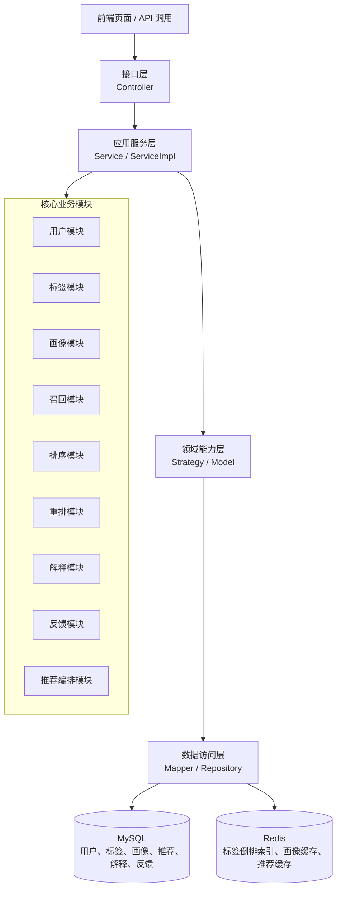
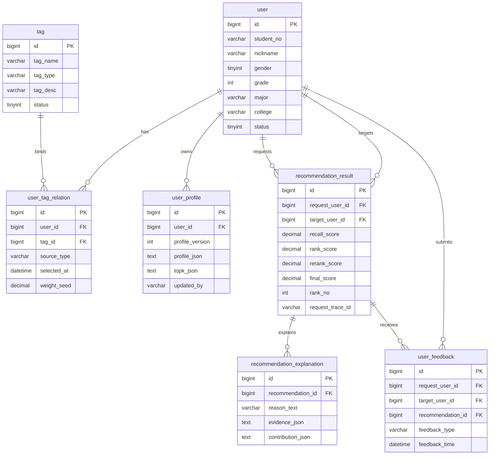

# Chapter 4 Diagram Drafts

本页提供第 4 章必要设计图的可绘制底稿。图号和题注仅为建议，最终编号以学校 Word 模板为准。

## 1. 图 4-1 系统总体架构图

### 1.1 论文题注建议

图 4-1 系统总体架构图

### 1.2 图中层次

```text
前端页面 / API 调用
        |
接口层 Controller
        |
应用服务层 Service / ServiceImpl
        |
领域能力层 Strategy / Model
        |
数据访问层 Mapper / Repository
        |
MySQL + Redis
```

### 1.3 Mermaid 底稿



### 1.4 正文衔接写法

可放在第 4.1 节末尾：

> 系统总体架构如图 4-1 所示。接口层负责接收外部请求，应用服务层负责编排推荐主链路，领域能力层沉淀画像、召回、排序、重排和解释等核心策略，数据访问层负责访问 MySQL 与 Redis。该结构既能满足毕业设计实现要求，也能保证推荐流程具有清晰的测试边界。

## 2. 图 4-3 数据库 ER 图

### 2.1 论文题注建议

图 4-3 数据库 ER 图

### 2.2 核心实体关系

```text
user 1 -- n user_tag_relation n -- 1 tag
user 1 -- n user_profile
user 1 -- n recommendation_result
recommendation_result 1 -- n recommendation_explanation
recommendation_result 1 -- n user_feedback
```

### 2.3 Mermaid 底稿



### 2.4 正文衔接写法

可放在第 4.4 节核心表说明后：

> 数据库核心实体关系如图 4-3 所示。用户与标签通过 `user_tag_relation` 建立多对多关系，该关系是画像计算的基础数据来源；`user_profile` 保存聚合后的画像结果；`recommendation_result` 记录一次推荐任务中的候选对象、排序分数和追踪标识；`recommendation_explanation` 保存推荐解释及证据；`user_feedback` 记录用户对推荐结果的关注或忽略行为。

## 3. 绘图注意事项

- Word 正式稿中建议使用中文节点名，避免图中出现过多类名或接口路径。
- 图 4-1 重点表达分层和模块归属，不需要展开每个接口。
- 推荐主链路流程图已迁移到 `chapter5_diagram_drafts.md`，本页只维护第 4 章概要设计图。
- 图 4-3 重点表达核心实体关系，字段只保留主键、外键和能说明业务含义的字段。
- 若使用 Mermaid 导出图片，应在 Word 中重新检查字体、线条和题注格式。
