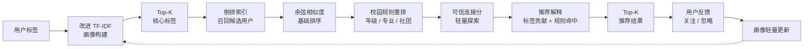
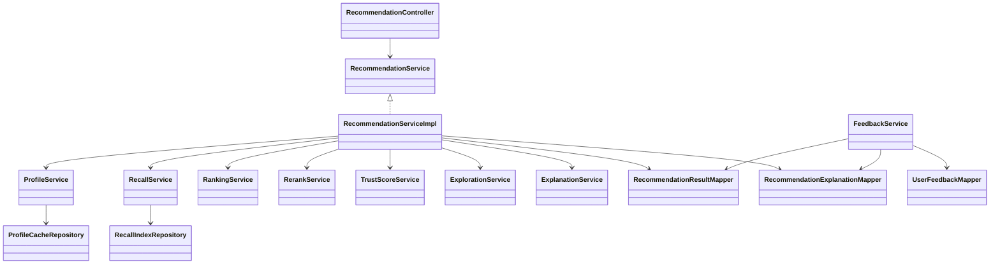
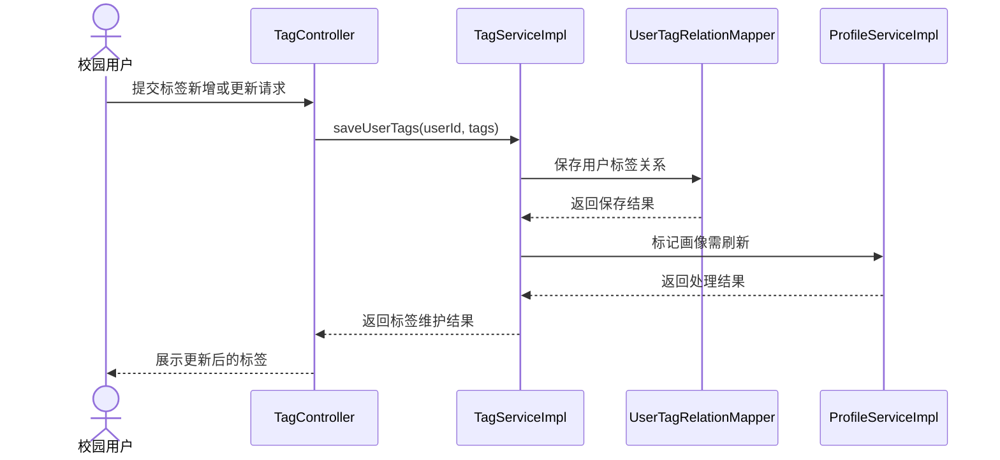
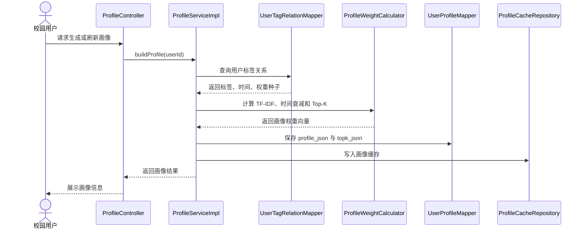
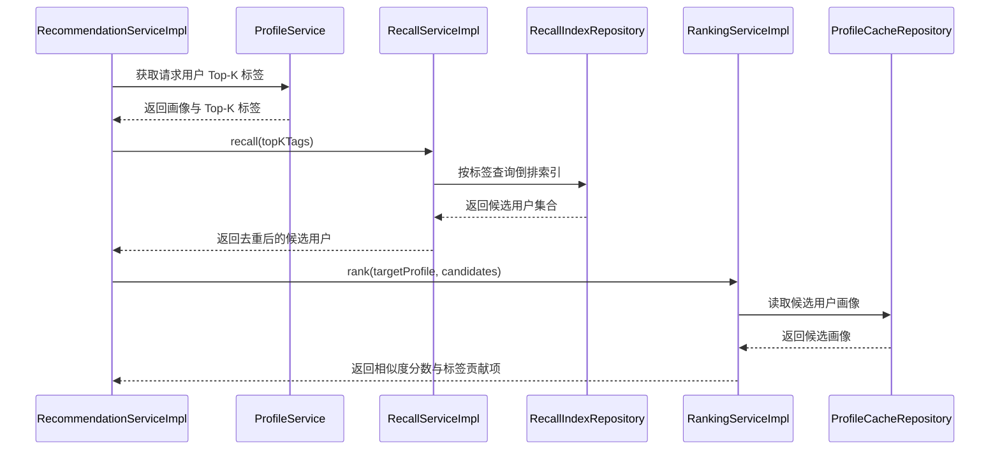
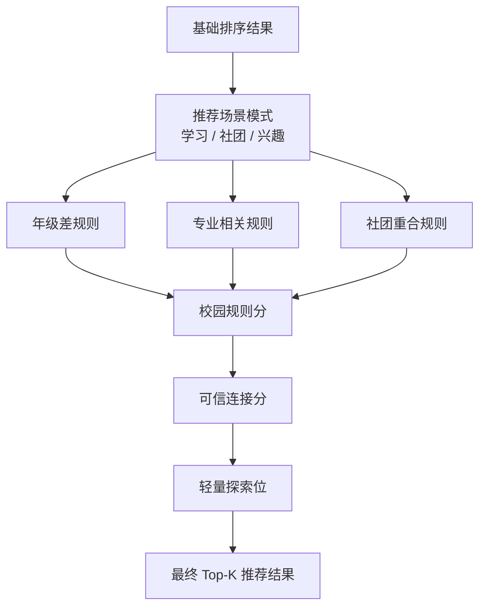
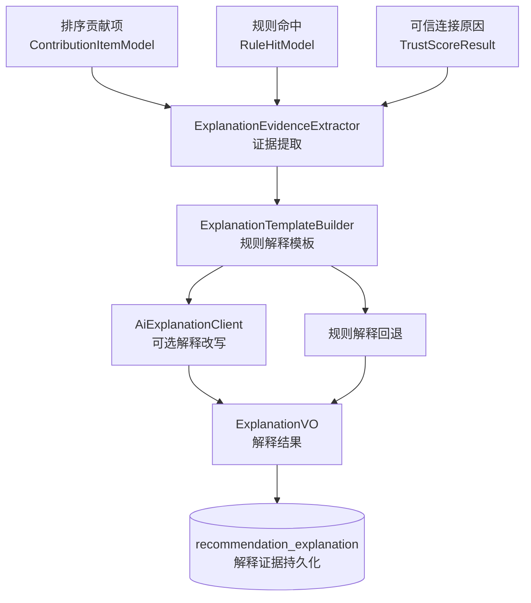
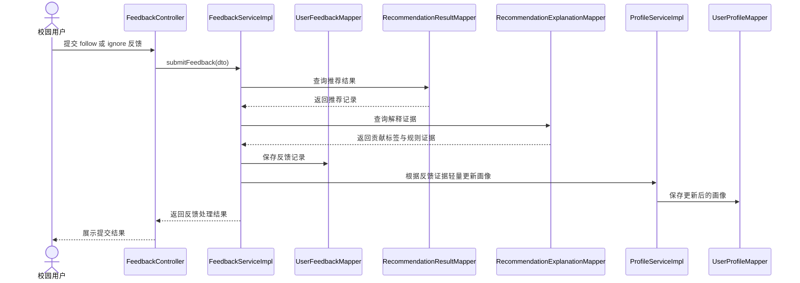

# Chapter 5 Diagram Drafts

本页提供第 5 章“详细设计与实现”图表底稿。图号、表号和题注仅为建议，最终编号以学校 Word 模板为准。第 5 章不再使用“主要包职责表”，也不展开接口参数和运行配置。

## 1. 图 5-1 推荐主链路流程图

### 1.1 论文题注建议

图 5-1 推荐主链路流程图

### 1.2 Mermaid 底稿

## 2. 图 5-2 系统核心类图

### 2.1 论文题注建议

图 5-2 系统核心类图

### 2.2 Mermaid 底稿

## 3. 图 5-3 用户标签维护时序图

### 3.1 论文题注建议

图 5-3 用户标签维护时序图

### 3.2 Mermaid 底稿

## 4. 图 5-4 用户画像生成时序图

### 4.1 论文题注建议

图 5-4 用户画像生成时序图

### 4.2 Mermaid 底稿

## 5. 图 5-5 候选召回与相似度排序时序图

### 5.1 论文题注建议

图 5-5 候选召回与相似度排序时序图

### 5.2 Mermaid 底稿

## 6. 图 5-6 校园规则重排流程图

### 6.1 论文题注建议

图 5-6 校园规则重排流程图

### 6.2 Mermaid 底稿

## 7. 图 5-7 推荐解释证据流图

### 7.1 论文题注建议

图 5-7 推荐解释证据流图

### 7.2 Mermaid 底稿

## 8. 图 5-8 反馈更新时序图

### 8.1 论文题注建议

图 5-8 反馈更新时序图

### 8.2 Mermaid 底稿

## 9. 表 5-3 核心服务实现说明

### 9.1 论文表题建议

表 5-3 核心服务实现说明

### 9.2 表格底稿

| 服务 | 主要实现类 | 核心职责 |
| --- | --- | --- |
| 用户画像服务 | `ProfileServiceImpl` | 构建用户画像、保存画像结果、维护画像缓存 |
| 候选召回服务 | `RecallServiceImpl` | 根据 Top-K 标签和倒排索引召回候选用户 |
| 排序服务 | `RankingServiceImpl` | 计算画像余弦相似度和标签贡献项 |
| 重排服务 | `RerankServiceImpl` | 应用年级、专业、社团等校园规则 |
| 可信连接服务 | `TrustScoreServiceImpl` | 根据资料完整度和匹配证据计算可信连接分 |
| 探索服务 | `ExplorationServiceImpl` | 在特定场景中保留轻量探索位 |
| 解释服务 | `ExplanationServiceImpl` | 提取解释证据、生成规则解释、处理外部解释改写回退 |
| 反馈服务 | `FeedbackServiceImpl` | 保存用户反馈并触发画像轻量更新 |
| 推荐编排服务 | `RecommendationServiceImpl` | 串联画像、召回、排序、重排、解释和持久化流程 |

## 10. Word 阶段处理项

- 本页图稿应在 Word 阶段重新绘制或由 Mermaid 导出后统一字体、线条和题注。
- 图 5-2 核心类图只展示论文所需主干关系，不展开全部 DTO、VO 和普通 Mapper。
- 图 5-7 和图 5-8 可以根据篇幅二选一保留；若导师关注创新点，优先保留图 5-7。
- 运行效果截图若必须加入论文，建议放入第 6 章“测试与运行效果”，并由人工提供截图或在本地运行系统后自动截取。
